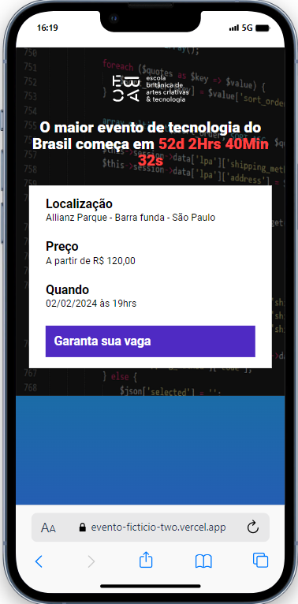
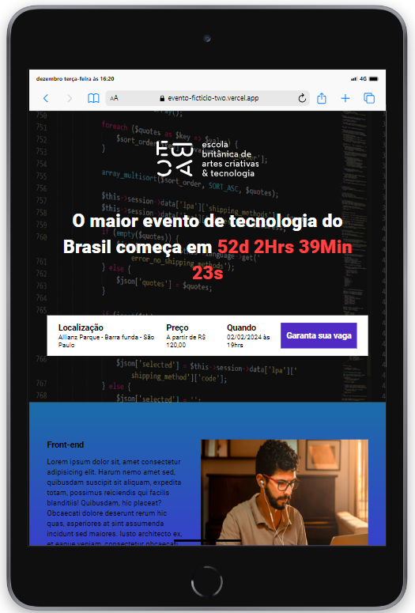

    

<h1 align="center">Land Page Evento aniversário</h1>

Página criada com o objetivo de aplicar e aprimorar conhecimentos adquiridos com estudos 
aprofundados em HTML5, CSS3, JAVASCRIPT, PARCEL e SASS

<h3 align="center" style="color:red;">Considerando a responsividade como parte vital</h3>

    
    

